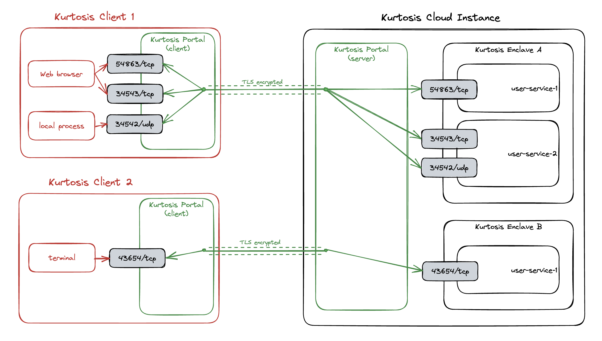

Kurtosis Portal
==============
Kurtosis Portal's responsibility is to enable seamless interactions with Kurtosis enclaves running remotely, i.e. cloud 
enclaves. More concretely, the main responsibility of the Portal as of today is to automatically forward exposed
ports of services running inside Kurtosis Cloud all the way back the user laptop.

Not familiar with Kurtosis? See Kurtosis main repository [here][kurtosis-repo] and the 
documentation [here][kurtosis-docs]

## Use case
```bash
# working inside a remote context - services will run in a cloud instance of Kurtosis
> kurtosis context switch my-remote-context
Switching context...
...
Successfully switched context

# Create an enclave and spin up nginx with port 80 exposed
> kurtosis enclave add --name my-enclave
Creating new enclave...
...
> kurtosis service add my-enclave my-nginx nginx --ports http-port=http:80/tcp
Service ID: my-nginx
Ports Bindings:
Name:           my-nginx
UUID:           5b85fe13fe6f
   http-port:   80/tcp -> http://127.0.0.1:32956
```

Even though the service is running on Kurtosis Cloud (i.e. not in local docker), the Portal makes it possible to reach
the service as if it was running on `localhost`:

```bash
> nc -zv localhost 32956
Connection to localhost port 32956 [tcp/*] succeeded!
```

## How Kurtosis Portal works
Kurtosis Portal is composed of 2 pieces of software bundled into the same binary: the server and the client.
- Portal Client runs on the user host as a lightweight daemon. It communicates with the server and requests a remote 
port to be forwarded back to it;
- Portal Server runs on the host where Kurtosis enclaves are running. It receives port forward requests from various
clients and makes sure the ports are forwarded to them appropriately.



Under the hood, Kurtosis Portal uses [Chisel][chisel] to handle ports forwarding.

Other than to start and stop it, interactions with the Kurtosis Portal is seamless to the end user. When working inside
a remote context, Kurtosis takes care of forwarding all necessary ports to provide a user experience similar to what the
user would have with fully local services.

Kurtosis Portal can be started and stopped using two following commands from [Kurtosis CLI][kurtosis-cli]:
```bash
> kurtosis portal start
> kurtosis portal stop
```
Once the portal is running, to connect to a remote Kurtosis server, a remote context will need to be configured 
providing a context configuration file.
```bash
kurtosis context add /path/to/context/config/file.json
```
Kurtosis Cloud is owned by Kurtosis right now. Contact Kurtosis for more information on how to use it and obtain a
connection file.

<!-------- ONLY LINKS BELOW THIS POINT -------->
[chisel]: https://github.com/jpillora/chisel
[kurtosis-docs]: https://docs.kurtosis.com
[kurtosis-cli]: https://docs.kurtosis.com/install
[kurtosis-repo]: https://github.com/kurtosis-tech/kurtosis
